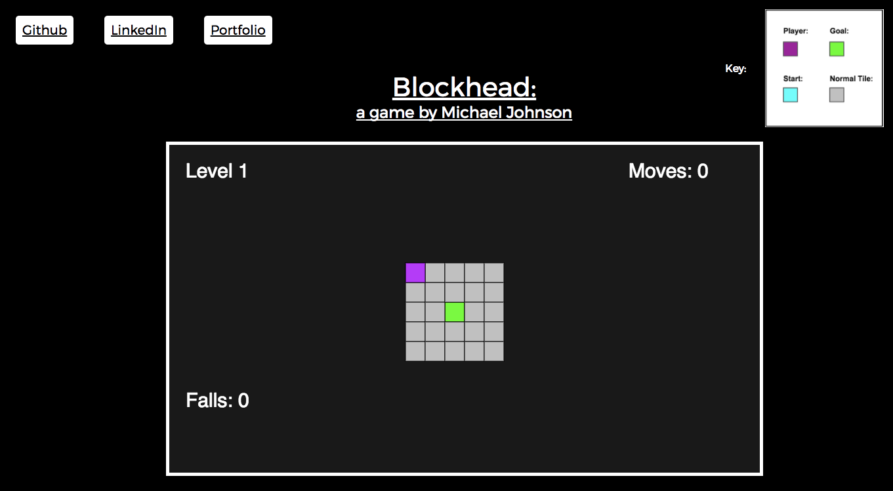

# JS Project Proposal: Blockhead

### Background:

Blockhead is a game that is based on the 3D puzzle game bloxors, in which the players must move a rectangular prism across a board into a hole. The main difference with this game is that the view will be strictly overhead.

### Functionality & MVP:

Blockhead

- [ ] Render tiles to the screen
- [ ] Make block movable with arrow keys
- [ ] Block falls off board if not set on tiles, resetting level
- [ ] Level changes when goal is reached
- [ ] production README

### Architecture and Technologies:

- 'JavaScript' (game logic)
- 'Canvas' (rendering of board tiles and block)

The game will require the following files:

- 'floor.js' to group tiles and handle the board logic in response to player input
- 'tile.js' to render individual tiles onto the screen
- 'block.js' to handle the movement logic for the block
- 'level.js' to handle transitioning between levels on success
- 'root.js' to bundle all the files together

### Wireframes:

The app is contained in one screen with nav links to my Github and LinkedIn in the top left corner. Control of the game is toggled with the mouse, and in the game players can move the block with the arrow keys. Instructions are provided on the bottom of the page for the player's convenience, and a tutorial level will also be provided to give the player room to feel out the game.

### Implementation Timeline:

**Day 1:** Setup the project.

**Day 2:** Render the board and movable block.

**Day 3:** Set rules for block falling off board reaching goal.

### Bonus Features:

- [ ] Make floor destructible: Tiles will disappear after being stepped on x times. The current status of a tile will be marked by color.
